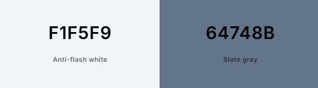

# Possible Color Schemes

## Dark Mode

### Core Colors

- Main Text: #E5E9F0 (primary text)
- Secondary Text: #A0AEC0 (descriptions, metadata)
- Tertiary Text: #718096 (placeholder text)
- Background: #1A1E23 (main background)
- Foreground: #232931 (cards, containers)
- Border: #2D3748 (subtle borders)
- Divider: #2D3748 (dividing lines)

### Interactive Elements

- Links: #FF9F7D (links, interactive text)
- Link Hover: #FFB299 (hover state)
- Button: #FF9F7D (primary buttons)
- Button Hover: #FFB299 (button hover)
- Button Disabled: #4A5568 (inactive buttons)

### Input Fields

- Input Background: #2D3748 (form fields)
- Input Border: #4A5568 (form field borders)
- Input Focus Border: #FF9F7D (focused field highlight)
- Input Placeholder: #718096 (placeholder text)

### Status Colors

- Success: #2ECC71 (darker success for dark mode)
- Error: #E74C3C (darker error for dark mode)
- Warning: #F1C40F (darker warning for dark mode)
- Info: #3498DB (darker info for dark mode)

### Category/Tag Colors

- Tag Background: #2D3748 (dark tag bg)
- Tag Text: #A0AEC0 (tag text)

## Light Mode

### Core Colors

- Main Text: #2D3436 (primary text)
- Secondary Text: #636E72 (descriptions, metadata)
- Tertiary Text: #B2BEC3 (placeholder text)
- Background: #F7F9FC (main background)
- Foreground: #FFFFFF (cards, containers)
- Border: #E2E8F0 (subtle borders)
- Divider: #EDF2F7 (lighter dividing lines)

### Interactive Elements

- Links: #E17055 (links, interactive text)
- Link Hover: #FF8C6B (hover state)
- Button: #E17055 (primary buttons)
- Button Hover: #FF8C6B (button hover)
- Button Disabled: #CBD5E0 (inactive buttons)

### Input Fields

- Input Background: #FFFFFF (form fields)
- Input Border: #CBD5E0 (form field borders)
- Input Focus Border: #E17055 (focused field highlight)
- Input Placeholder: #A0AEC0 (placeholder text)

### Status Colors

- Success: #26DE81 (confirmations)
- Error: #EB4D4B (error messages)
- Warning: #FED330 (warning messages)
- Info: #45AAF2 (information messages)

### Category/Tag Colors

- Tag Background: #F1F5F9 (light tag bg)
- Tag Text: #64748B (tag text)

